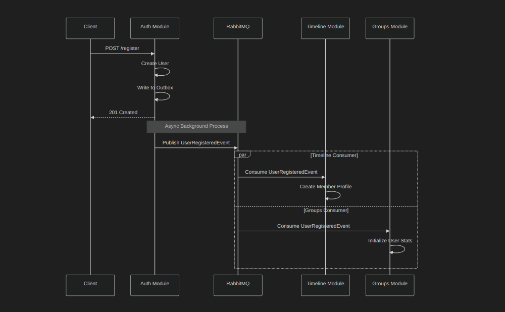

# Architecture Documentation

## System Overview

AAU Connect is built as a **Modular Monolith** to ensure logical separation of concerns while maintaining the simplicity of a single deployment unit.

### High-Level Components
- **API**: ASP.NET Core Web API (endpoints, orchestration)
- **Modules**: Auth, Timeline, Groups, Messaging (Bounded Contexts)
- **Database**: PostgreSQL (Schema per module)
- **Messaging**: RabbitMQ (Inter-module communication)
- **Identity**: Keycloak (Authentication & Identity Management)

---

## Clean Architecture Layers

Each module follows **Clean Architecture** principles to ensure separation of concerns and testability.

- **Domain**: Entities, Value Objects, Domain Events, Repository Interfaces. No dependencies.
- **Application**: Commands, Queries, DTOs, Validators. Depends only on Domain.
- **Infrastructure**: Database implementation, External Service adapters. Depends on Application (interfaces) and Domain.
- **API**: HTTP Endpoints (Carter modules). Orchestrates requests.

---

## Transactional Outbox Pattern

To ensure reliability data consistency between the database and the message broker, we implement the **Transactional Outbox Pattern**.

### Sequence Flow

---

## Event-Driven Communication

Modules communicate exclusively via **Domain Events** over RabbitMQ.

### Example: User Registration Flow

When a user registers in the **Auth Module**, other modules react to create local profiles or trigger actions.

